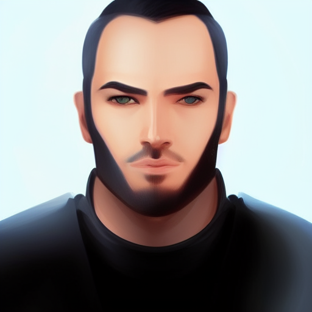
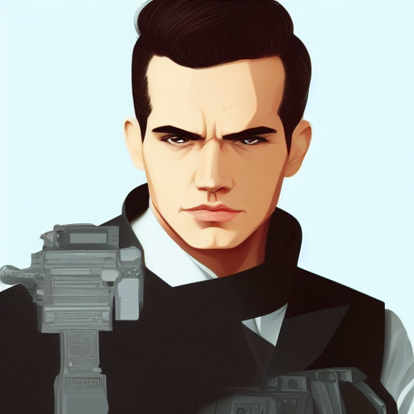
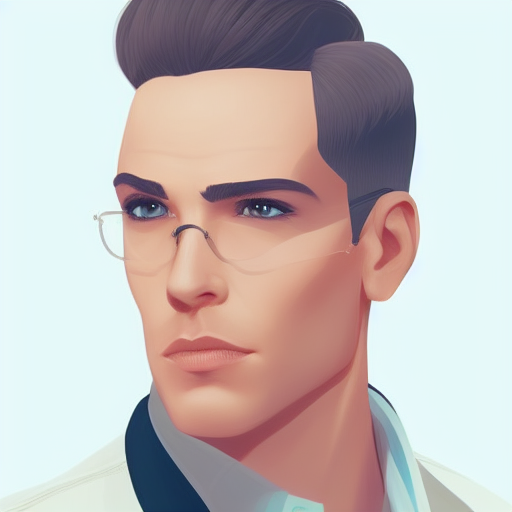
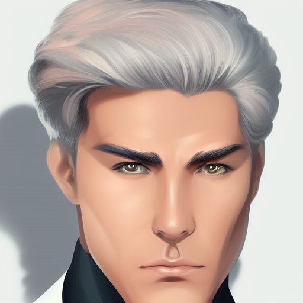
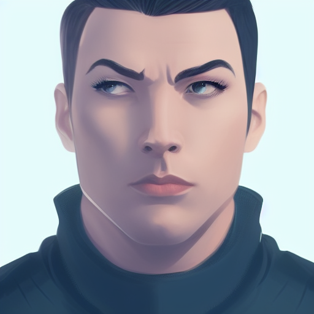
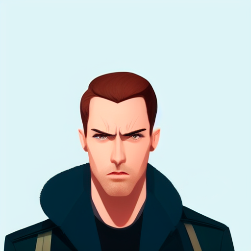

<h4 align="right">

<a href="https://twitter.com/thenottgaming?ref_src=twsrc%5Etfw" class="twitter-follow-button" data-show-count="false">Follow @thenottgaming</a>
</h4>

  

    
  

  

      
    We design, develop & market VR videogames. Speak with one of our consultants to get a quote on your project today.
  

 

* We are a team of 7 students living in the Basque Country whom are learning how to develop VR applications in Unreal Engine 5.
* [This is our GitHub Organizations profile](https://github.com/Nott-Gaming)
* Click the `Follow` button on the top right. (OK, this step is facultative, but that would make you a nice person 😁)

 

## 
Our team members

| 
ADRIÁN
                                                  | 
AXEL
                                                 | 
DANIEL
 | 
JONATHAN
 | 
JORGE
 | 
KEVIN
 | 
VÍCTOR
                                                   |
|--------------------------------------------------------------------------|-----------------------------------------------------------------------|--------------------------------------------------------------------|-------------------------------------------------------------------------|------------------------------------------------------------------|------------------------------------------------------------------|---------------------------------------------------------------------------|
|  |  |  |  |  |  |  |

 