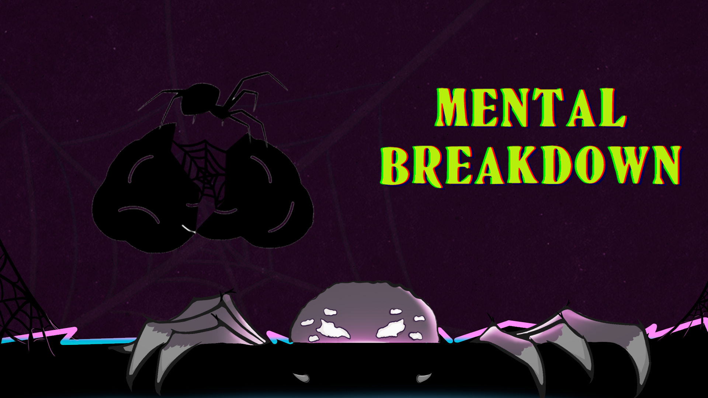
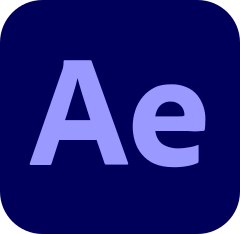
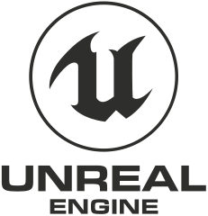
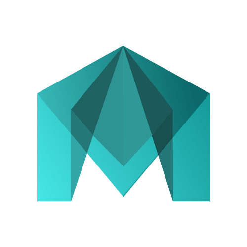
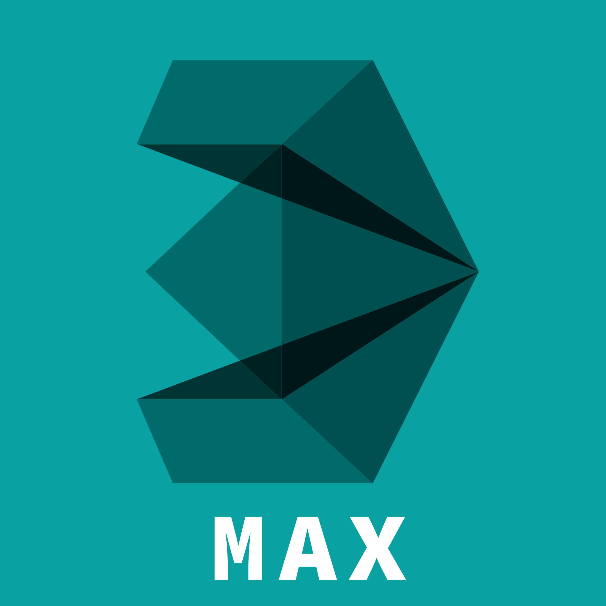
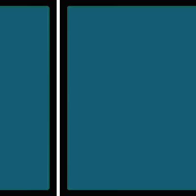
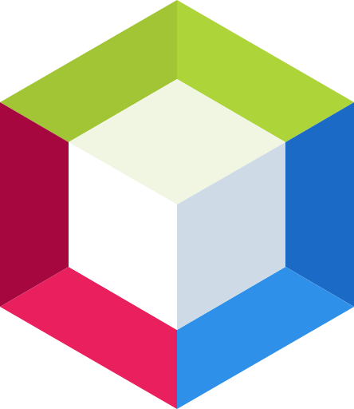
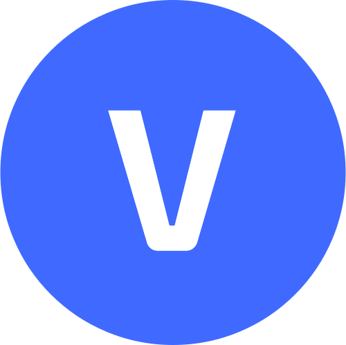

<h4 align="right">

</h4>

We design, develop, & market VR videogames. Speak with one of our consultants to get a quote on your project today. Email our team at <a href="mailto:{{ site.email }}">
                {{ site.email }}
              </a>.
* We are a team of 7 students living in the Basque Country whom are learning how to develop VR applications in Unreal Engine 5.
* [This is our GitHub Organizations profile](https://github.com/Nott-Gaming)
* Click the `Follow` button on the top right. (OK, this step is facultative, but that would make you a nice person 😁)

 

## Our current project

 
 
 
 
 
 
 
 
 
 

## 
Our team members

| 
ADRIÁN
                                           | 
AXEL
 | 
DANIEL
 | 
JONATHAN
 | 
JORGE
 | 
KEVIN
 | 
VICTOR
 |
|-------------------------------------------------------------------|----------------------------------------------------------------|--------------------------------------------------------------------|-------------------------------------------------------------------------|------------------------------------------------------------------|------------------------------------------------------------------|--------------------------------------------------------------------|
|  |  |  |  |  |  |  |

  
 
 
  

### ADRIÁN  

`Game Programmer, 3D Modeler/Animator`

   

 

* Programming since 2017
  * [Videogame Development Portfolio](https://www.artstation.com/adrianroblesabella)
* Markup/programming languages:
  * HTML
  * C#  

### AXEL 

`Magician, Musician, 3D Animator, Games and Interactive Environments & Network Computer Systems Administrator`

   

* Programming since 2019
  * [Music Artist Portfolio](https://afaces.tk)
  * [Developer Portfolio](https://axlfc.github.io)
  * [YouTube channel](https://www.youtube.com/c/axelaxel12)
  * [GitHub profile](https://github.com/Axlfc)
  * [LinkedIn](https://www.linkedin.com/in/axelcurros/)
* Markup/programming languages:
  * HTML
  * Markdown
  * CSS
  * Jekyll
  * Javascript
  * Python
  * PHP
  * Bash
  * Powershell

### DANIEL

`Multiplatform Applications and Videogames Programmer`

   

* Programming since 2020
  * [GitHub profile](https://github.com/danniellz)
* Markup/programming languages:
  * HTML
  * CSS
  * Java
  * SQL

### JONATHAN 

`Game Programmer, 3D Modeler/Animator & Junior Programmer`

   

* Programming since 2020
  * [GitHub profile](https://github.com/Jonathan673)
* Markup/programming languages:
  * HTML
  * Java
  * Wordpress
  * SQL
  * Odoo
  * CSS

### JORGE 

`Multiplatform Applications and Videogames Programmer`

   

* Programming since 2019
  * [GitHub profile](https://github.com/jorgeccst)
* Markup/programming languages:
  * Java
  * C#
  * HTML
  * CSS
  * XML

### KEVIN 

`Network Computers Systems Administrator`

* Programming since
  * [GitHub profile](https://github.com/Kevin0289)
* Markup/programming languages:
  * HTML
  * PHP
  * CSS
  * XML

### VICTOR 

`3D modeler, Animator & Texture Artist and Amateur Cartoonist`

* [ArtStation profile](https://www.artstation.com/victor_llano)